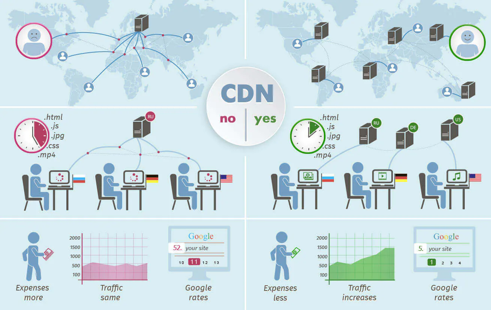

#Clase 01

## Archivo Markdown(md)
Es un archivo que permite documentar, tomar apuntes, etc, para los proyectos.

## Formas de contacto
* mail: mlaeducacionit@gmail.com
* discord: maxiprincipe
* Soporte: soporteonline@educacionit.com
* Empresas: empresas@educacionit.com

## Instalaciones necesarias
* Visual Studio Code
* Github
* Node
* Git

## Pagina oficial de Vue
<https://vuejs.org/>

## Emmet
<https://docs.emmet.io/cheat-sheet/>

## Extensiones

* Auto Rename Tag
* Live Server
* Material Icon Theme
* Prettier / Split HTML
* Thunder Client
* Todo Tree
* Vue Language Features (volar) -> No tiene snippets

## Copiar imagenes

## Modelo de Vue 
* Modelo-vista vista-modelo(mvvm)

